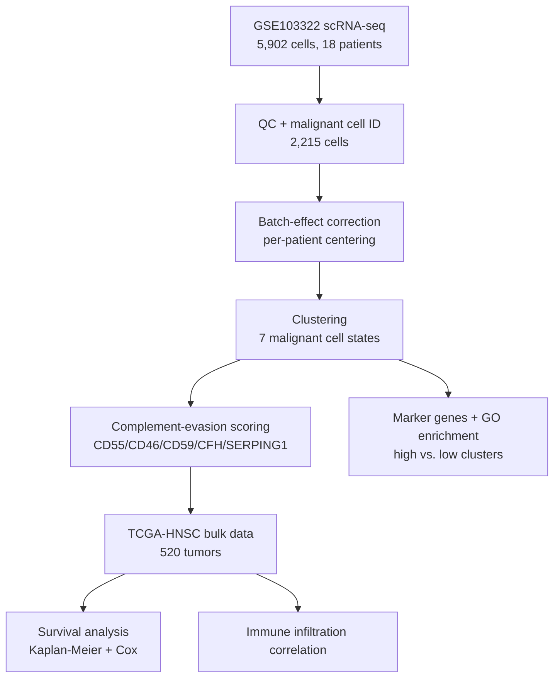
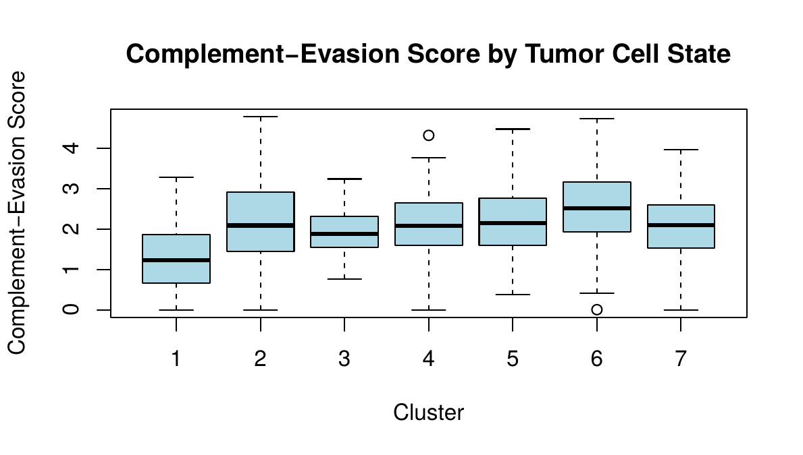
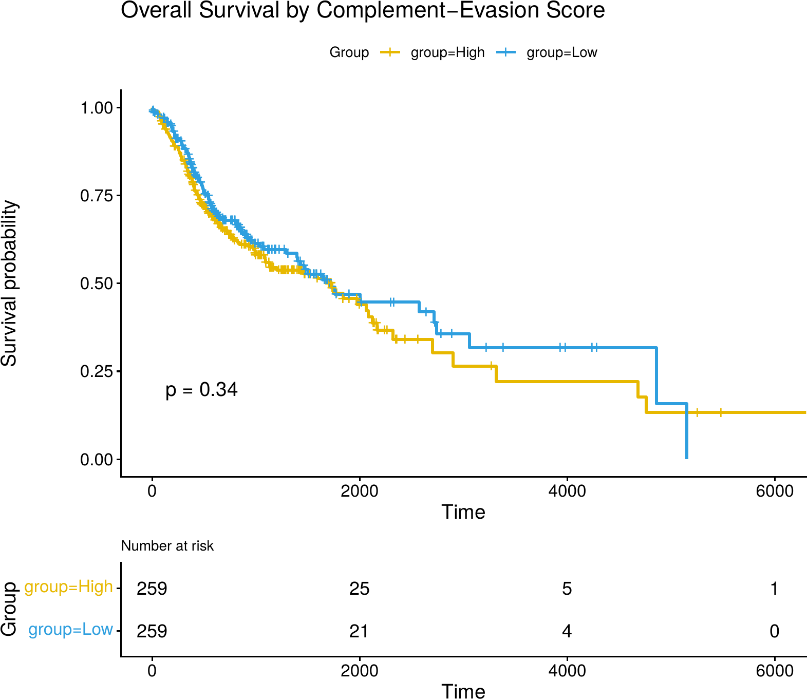
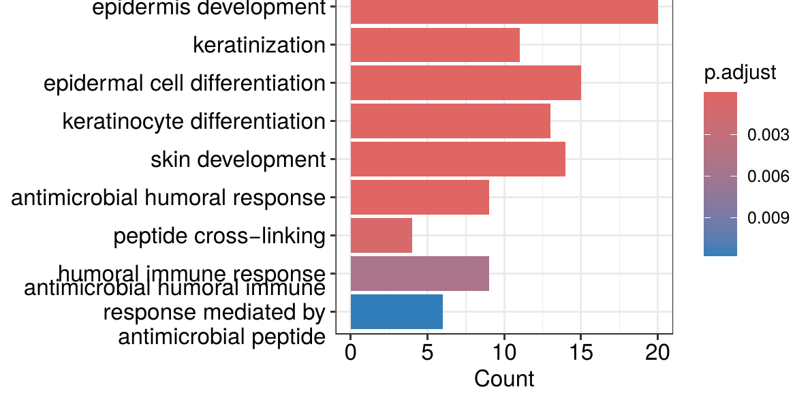

# Complement-Evasion HNSCC

Single-cell and bulk RNA-seq analysis of tumor-intrinsic complement regulatory gene 
expression in head and neck squamous cell carcinoma (HNSCC).

## Overview

This project characterizes a five-gene complement-evasion signature (CD55, CD46, CD59, 
CFH, SERPING1) across malignant cell states (single-cell RNA-seq) and bulk tumors (TCGA), 
testing its relationship to immune infiltration, survival, and tumor cell differentiation state.

**Preprint:** [link to be added once live on bioRxiv]

## Pipeline Overview

## Key Results

**Figure 1 — Complement-evasion score differs significantly across malignant cell states**

**Figure 2 — No independent survival association**

**Figure 3 — High complement-evasion cluster shows squamous differentiation + antimicrobial defense enrichment**

## Results Summary

- **Malignant cells form 7 transcriptionally distinct states** that differ significantly in 
  complement-evasion score (Kruskal-Wallis χ² = 119.46, df = 6, p < 2.2 × 10⁻¹⁶), after 
  correcting for a strong patient-of-origin batch effect.

- **The highest complement-evasion cluster** is marked by a squamous differentiation and 
  antimicrobial/humoral immune defense gene program (9 significantly enriched GO terms, 
  all FDR < 0.05), including genes with known immunomodulatory roles in cancer (LGALS3, 
  SLPI, CEACAM6, IL1RN).

- **Complement-evasion score does not independently predict overall survival** in TCGA-HNSC 
  (n = 518), either unadjusted (HR = 1.14, p = 0.27) or adjusted for tumor stage (HR = 1.22, 
  p = 0.18).

- **Complement-evasion score is significantly positively correlated with immune infiltration** 
  in bulk tumors (Spearman ρ = 0.36, p < 2.2 × 10⁻¹⁶) — the opposite direction from a simple 
  immune-evasion hypothesis, and consistent (though weaker) in the single-cell cohort.

- **Interpretation:** these findings support an adaptive resistance model, in which malignant 
  cells in a differentiated squamous state co-opt normal epithelial defense programs in 
  response to immune pressure, rather than complement regulation acting as a primary immune 
  evasion mechanism.

Full statistical details in [Table 1](#) and the [preprint](#) (link to be added once live).

## Data Sources

- **Single-cell RNA-seq:** GEO accession [GSE103322](https://www.ncbi.nlm.nih.gov/geo/query/acc.cgi?acc=GSE103322) 
  (Puram et al., 2017), accessed via Bioconductor ExperimentHub (record EH5419)
- **Bulk RNA-seq and clinical data:** TCGA-HNSC, accessed via [TCGAbiolinks](https://bioconductor.org/packages/TCGAbiolinks/) 
  and the NCI Genomic Data Commons

Raw data is not included in this repository; scripts re-download it directly from the 
sources above.

## Pipeline / Scripts

| Script | Description |
|---|---|
| `Scripts/01_scRNA_QC_clustering.R` | Load GSE103322, QC, batch-effect correction, malignant cell clustering |
| `Scripts/02_complement_scoring.R` | Complement-evasion gene panel scoring |
| `Scripts/03_marker_genes_enrichment.R` | Cluster marker genes and GO enrichment |
| `Scripts/04_TCGA_bulk_analysis.R` | TCGA-HNSC download, complement/immune scoring |
| `Scripts/05_survival_analysis.R` | Kaplan-Meier and Cox regression |

## Requirements

R (≥4.5), with Bioconductor packages: `ExperimentHub`, `SingleCellExperiment`, `scran`, 
`scater`, `bluster`, `org.Hs.eg.db`, `TCGAbiolinks`, `clusterProfiler`, `survival`, `survminer`.

## Author

Alfina Mariam Sanoj 
